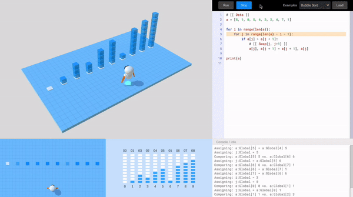

# SeedLang

SeedLang is an embeddable and visualizable scripting engine for .Net and Unity.

Example 1 - [SortingBot - A visualization tool of sorting
algorithms](https://github.com/SeedV/SeedLangExamples/tree/main/SortingBot). It
leverages SeedLang as its scripting and visualization engine:

Example 2 - [SeedCalc - A Wonder Calculator](https://github.com/SeedV/SeedCalc).
Its computing core is empowered by SeedLang:

## Documentation

See the [SeedLang Documentation](https://seedv.github.io/SeedLang/) site.

## Building

Please follow the [Building and Testing Guide](docs/building_and_testing.md) to
build SeedLang.

## Architecture Design

See the [Architecture Design](design/overview.md) doc.

## Contributing

For the developers of SeedLang, please check out the [Contributing
Guide](CONTRIBUTING.md) for guidelines about how to proceed.

## How to release

See the [Releasing Guide](RELEASING.md).
