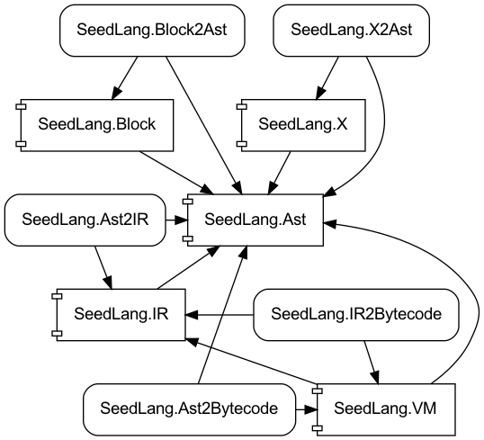

# Components of SeedLang

## Project Organization

The project orginzation of SeedLang follows [Organize your project to
support both .NET Framework and
.NET](https://docs.microsoft.com/en-us/dotnet/core/porting/project-structure):

```shell
SeedLang
└── core
   ├── src
   |   ├── SeedLang.Ast
   |   ├── SeedLang.Ast2Bytecode
   |   ├── SeedLang.VM
   |   ├── SeedLang.X
   |   └── SeedLang.X2Ast
   └── tests
       ├── SeedLang.Ast.Tests
       ├── SeedLang.VM.Tests
       └── SeedLang.X.Tests
```

## Components Dependency


