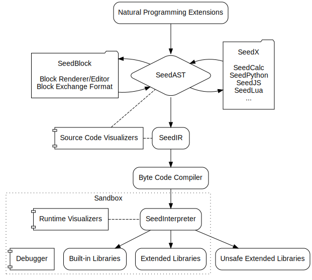

# SeedLang Architecture

## Overview

SeedLang is a visualizable low-code programming environment that focuses on
educational purposes.

The design of SeedLang highlights three priorities:

* Full-stack visualization.
* Clear and minimalist design.
* Embeddable and extensible.

## Architecture

## SeedAST

SeedAST is the abstract syntax tree to translate a SeedBlock code to a SeedX
code, and vice versa.

SeedAST defines a common subset of the language features shared among all SeedX
programming languages.

SeedAST is also the high-level intermediate representation to parse a SeedBlock
code or a SeedX code.

SeedAST has two representations:

* An in-memory data structure.
* A plaintext exchange format to serialize, deserialize, import and export ASTs.

## SeedBlock

SeedBlock is a set of utilities and specifications that enable the visual
programming experience, including:

* A block renderer/editor running at the GUI level to display, layout, and edit
  programming blocks.
* A plaintext block exchange format to serialize, deserialize, import, and
  export programming blocks.

Typically, SeedBlock can be translated into SeedAST, then into any one of the
SeedX languages.

## SeedX

SeedX is a set of programming languages that can be translated into SeedAST and
run by SeedInterpreter.

* SeedCalc: a lightweight sub-language to parse and execute arithmetic
  expressions. With SeedCalc, calculator applications can visualize every single
  step of an arithmetic calculation.
* SeedPython: an educational programming language that implements a subset of
  Python features.
* SeedJS: an educational programming language that implements a subset of
  JavaScript features.
* SeedLua: an educational programming language that implements a subset of Lua
  features.
* ... ...

Typically, SeedX languages can be translated into SeedAST, then into SeedBlock
representations. For doing this, the feature set of every SeedX language is
limited to the common subset that SeedAST defines.

## Natural Programming Extensions

Natural programming extensions introduce natural human-machine interactions into
the low-code programming environment. For example:

* An NLP extension can translate natural language instructions into SeedAST.
  Hence, one can control an agent with a voice recognition interface.
* A pre-trained AI model can also translate human poses and gestures into
  SeedAST to quickly demonstrate a new concept in the programming environment.

## SeedIR

SeedIR is a mid-level intermediate representation. Before running a SeedBlock
code or a SeedX code, we parse the source code into a SeedAST then generate a
SeedIR code out of the AST.

## Byte Code Compiler

A byte code compiler that translates and optimizes SeedIR code into a low-level
byte code representation.

## SeedInterpreter

SeedInterpreter executes the compiled byte code as a virtual machine.

SeedInterpreter provides a consistent set of characteristics and abilities no
matter where it is hosted. For example, we can set its heap size and stack size
to a fixed number across hosting machines. We can also limit the framerate to
run interactive apps on different hardware and OS.

## Sandbox

The Sandbox restricts the abilities of SeedInterpreter, to avoid unnecessary or
risky invocations to the hosting environment. It also sets up a security
boundary for the byte code running inside the virtual machine. Hence, it can
detect and identify malicious code as early as possible.

## Visualizers

Visualizers are the components that make the underlying logic of source code and
execution processes visible to end-users. Among other critical design decisions,
visualizers enable SeedLang to be an educational programming language.

SeedLang has two categories of visualizers:

* Source code visualizers analyze source code statically and explain semantical
  structures or underlying relationships. For example, we can visualize the
  internal structure of a value, a code block, a function, a complex grammar
  structure, or a semantical constraint with built-in or extended visualizers.
* Runtime visualizers analyze the execution of a program dynamically and
  visualize the states during the process. For example, we can visualize the
  current states of a stack, a dynamic binding, a function call graph, or the
  real-time states of a red-black tree.

SeedLang provides a limited number of built-in visualizers. Third-party
developers can contribute new visualizers by creating and submitting extensions.

## Debugger

The debugger helps users set breakpoints, inspect the runtime states of a
program, and identify the root cause of a bug.

## Built-in Libraries

SeedLang provides a number of built-in libraries to support the runtime.

## Extended Libraries

Third-party developers can extend the abilities of the SeedLang runtime by
creating and submitting library extensions.

## Unsafe Extended Libraries

SeedLang can also invoke unsafe code, but only outside of the sandbox. Unsafe
extended libraries may include:

* Native binary extensions.
* The extensions that invoke system calls or communicate directly with hardware
  interfaces, for example, to control an Arduino device.
