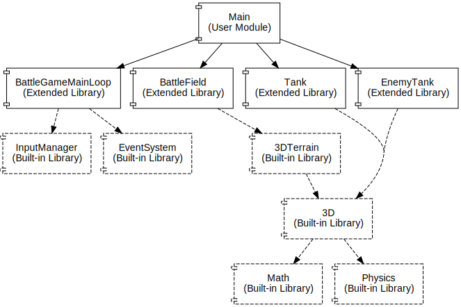
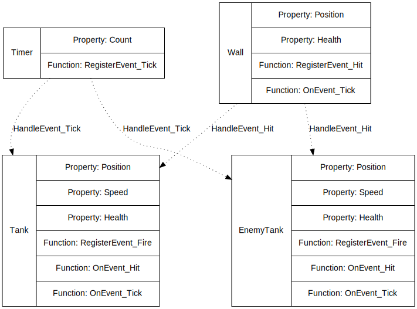
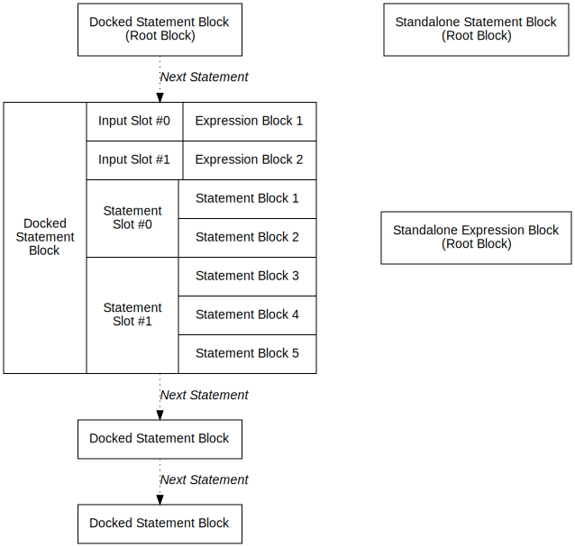
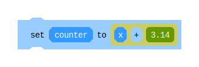
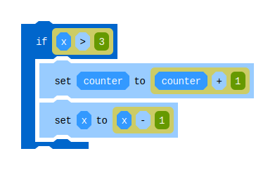
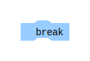
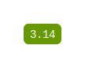
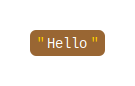

# SeedBlock

SeedBlock is one of the primary programming languages that SeedLang supports. It
provides a block-based visual coding environment and converts code blocks to
SeedAST.

With SeedLang's full-stack visualization framework, SeedBlock is also a critical
visualization front-end of SeedLang. Its user-facing code editor enables the
visualization of source code, in-memory values, data structures, control flows,
event-listener connections, runtime states of the SeedLang virtual machine, etc.

SeedBlock has a Block eXchange Format (BXF) to serialize a in-memory SeedBlock
program to a JSON string or a JSON file, or vice versa. See [BXF's
Design Doc](block_exchange_format.md).

## Feature Highlights

### Non-toy Coding Environment

Compared to Scratch, the most popular visual programming language for kids,
SeedBlock provides considerate support to many intermediate-level programming
language features.

(TODO: Show some examples.)

### Inline Editing

(TODO: Describe this.)

### Visualization

(TODO: Describe this.)

## Programming Views

SeedBlock supports three major programming views to fulfill different
development purposes: the inter-module view, the inter-object view, and the
code view.

### Inter-module View

A module is a SeedBlock code unit that contains objects and functions. A
SeedBlock program is composed of one or more modules, including user modules,
built-in library modules and extended library modules.

With the inter-module view, developers can make an application quickly by
installing and configuring pre-defined external modules. For example, developers
can build a small 3D tank battle game in a few minutes by following the steps:

1. Install and configure a pre-defined `BattleGameMainLoop` module to turn on
   the default input manager and event system for a 3D battle game.
2. Introduce a `BattleField` module to show the terrain of a 3D tank
   battlefield.
3. Install the pre-defined `Tank` and `EnemyTank` modules to put a
   user-controlled 3D game object and its rival game object onto the
   battlefield.

Besides the modules developers explicitly add to the program, the inter-module
view can show the entire dependency graph among modules when necessary. As
illustrated above, the inter-module view displays all the built-in library
modules as dashed shapes.

### Inter-object View

A SeedBlock object is a key-value map that maintains a set of named properties
and functions.

The inter-object view shows the event-handling relationships among the objects
defined in a program's modules. Developers use drag-and-drop operations to
connect a registered event (or the object that triggers the registered event) to
an event handler object (or the event handler function within the object).
Hence, developers can quickly create an interactive application with pre-defined
reusable objects without touching the code details.

For example, assuming that a game programming environment has a couple of
pre-defined objects, such as Tank, EnemyTank, Wall, and Timer, developers can
connect the pre-defined events like Tick or Hit to the pre-defined event
handlers inside the Tank object.

### Code View

As soon as developers have to write new code from scratch or edit existing code
provided by an extended library, they open a module's code view to work on every
single block.

The code view shows a module's code blocks on a 2D canvas. It is also a code
editor for developers to add new blocks, modify exiting blocks, remove blocks,
or change the blocks' positions and relationships.

The above diagram shows some different positioning states of blocks in the code
view. Some blocks may stay alone on the canvas. Developers may dock standalone
blocks together to fill a single block with empty input slots, build a compound
statement, or form a sequence of statement blocks.

See [Block Positions](#block-positions) for a detailed description of block
positions.

## Block Categories

The blocks supported by SeedBlock have two categories:

* Expression blocks
  * They have a value, or, can be evaluated to a value, or, can be associated
    with a value. Note that null value and identifiers are also counted as
    expression blocks in this context.
  * They have neither "previous statement connector" nor "next statement
    connector".
  * They can only be docked as an input of the target block.
* Statement blocks
  * They perform some operation but never result in a value.
  * They have both "previous statement connector" and "next statement
    connector".
  * They can be docked to a target block, to become the target block's next
    statement.
  * They can also be docked to one of a target block's statement slots, to
    become the target block's child statement.

## Block Positions

In the code view of a module, pre-defined or user-created blocks are organized
on a 2D canvas, with two different positioning types:

* Canvas position: The block's position is defined by a 2D coordinate (x, y) on
  the canvas.
* Dock position: The block is docked to another block (the target block) and its
  position is defined by the ID of the target block, the dock type, and a
  zero-based index (the dock slot index).

Depending on the position in the code view, a block may stay in one of the
following positioning states:

* Standalone block: A block is a standalone block if it is not docked to any
  other block, and there is no other block docking to it.
* Root block: A block is a root block if it is not docked to any other block,
  and there are one or more blocks docking to it.
* Docked block: A block is a docked block if it is docked to another block. The
  block it docks to is called "the target block".

As for docked blocks, there are three dock types:

* Input: The block docks to one of the target block's input slots. The dock slot
  index specified the zero-based sequence number of the input slot it docks to.
* NextStatement: The block docks as the target block's next statement. In this
  case, the dock slot index is not used.
* ChildStatement: The block docks as the first child statement, at one of the
  target block's statement slots. The dock slot index specified the zero-based
  sequence number of the statement slot it docks to.

Obviously, a block must have available input slots or available statement slots
if it allows other blocks to dock to:

* Input slot: The slot that can be docked by an expression block. I.e., the
  target block requires an input in the specified position.
* Statement slot: The slot that holds a sequence of statement blocks. I.e., a
  statement slot in SeedBlock corresponds to a statement block or a compound
  statement in text-based programming languages.

For example, a `Set` block has two input slots:

* Input Slots:
  * #0: accepts a variable block or an expression block that evaluates to a
    left value.
  * #1: accepts a primitive value block (number, string, boolean, color) or an
    expression block that evaluates to a right value.

And, an `If / If Else` block has one input slot and two statement slots (the
latter one of them is optional):

* Input Slots:
  * #0: the condition expression. It accepts an expression that evaluates to a
    boolean value.
* Statement Slots:
  * #0: the compound statement that executes when the condition expression
    evaluates to `True`.
  * #1 (Optional): the compound statement that executes when the condition
    expression evaluates to `False`.

Please notice that for each statement slot of a target block, only the first
child statement block is docked to the slot as the `ChildStatement` type. The
rest child statement blocks in the same slot are docked as the `NextStatement`
type instead.

For example, if an `If` block needs to execute a sequence of two statement
blocks when the if condition is `True`, the first statement block (block A) is
docked to the If block as the `ChildStatement` type, and the second statement
block (block B) is docked to block A as block A's `NextStatement`.

## Supported Blocks

Here is a full list of all the supported blocks.

NOTE that the block images in this doc are for example purposes only.

### Break

* Block Category: Statement Block
* Description: Break from a loop

Example:

### If / If Else

* Block Category: Statement Block
* Description: Conditional control flow
* Input Slots:
  * #0: the condition expression. It accepts an expression that evaluates to a
    boolean value.
* Statement Slots:
  * #0: the compound statement that executes when the condition expression
    evaluates to `True`.
  * #1 (Optional): the compound statement that executes when the condition
    expression evaluates to `False`.

Example:

### Null

* Block Category: Expression Block
* Value: null

Example:

(TODO: Add example images.)

### Number

* Block Category: Expression Block
* Value: a decimal value (implemented by the `double` type of the hosting
  environment)

Example:

### Set

* Block Category: Statement Block
* Description: Set a variable to a value
* Input Slots:
  * #0: accepts a variable block or an expression block that evaluates to a
    left value.
  * #1: accepts a primitive value block (number, string, boolean, color) or an
    expression block that evaluates to a right value.

Example:

### String

* Block Category: Expression Block
* Value: a UNICODE string.

Example

(TODO: Complete the supported block list.)