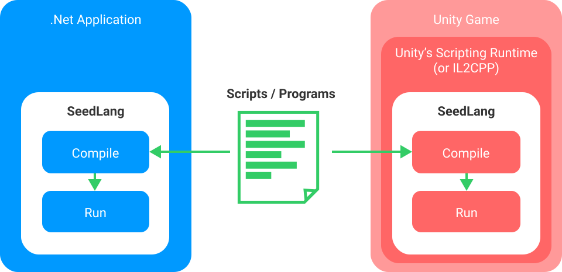
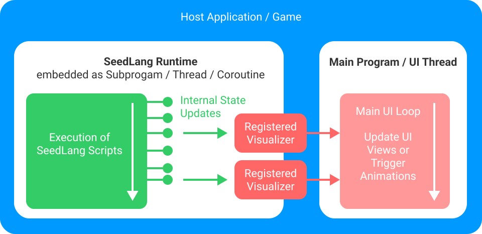

# Overview

SeedLang is an embeddable and visualizable scripting engine for .Net and Unity.

## What is SeedLang?

First, SeedLang is an embeddable scripting engine. SeedLang is able to compile
and run a number of scripting languages, including SeedCalc, SeedPython, etc.
With SeedLang, .Net developers and Unity developers can embed the SeedLang
runtime in a .Net application or a Unity game. A typical usage of SeedLang is
creating an educational game with Unity, where kids can enter simple programs to
control a robot, a car or a cat to solve challenging tasks.

Second, SeedLang is a visualizable programming environment. With SeedLang's
**full-stack visualization** feature, it is super easy to monitor the internal
real-time states of a running script. Every single internal state change of a
running script can be hooked with an event handler, aka. a visualizer.
Visualizers can notify the UI layer to visualize the internal state changes by
updating UI views or triggering animations.

## Examples

Example 1 - [SortingBot - A visualization tool of sorting
algorithms](https://github.com/SeedV/SeedLangExamples/tree/main/SortingBot). It
leverages SeedLang as its scripting and visualization engine:

Example 2 - [SeedCalc - A Wonder Calculator](https://github.com/SeedV/SeedCalc).
Its computing core is empowered by SeedLang:

See
[https://github.com/SeedV/SeedLangExamples](https://github.com/SeedV/SeedLangExamples)
for more example applications and games.

## Getting Started

For the usage and the examples of SeedLang, see [Getting
Started]().
